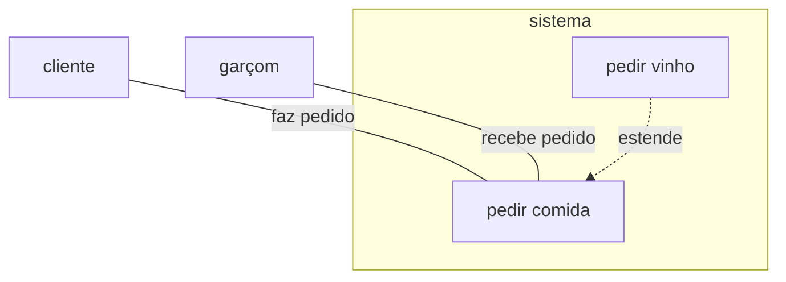
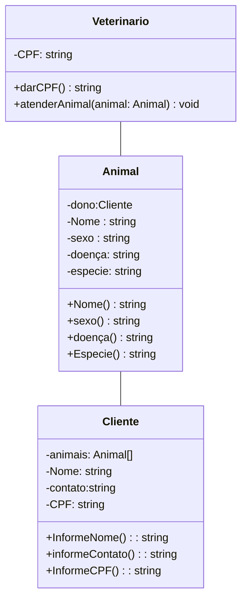

# trabalho-engenharia-software-2026
Trabalho de clínica veterinária do Técnico em Informática, segundo semestre de 2026.

 LINK DO PROJETO DO FIGMA https://www.figma.com/design/KTFpXc7RjeLND2oYifGWly/Sem-t%C3%ADtulo?node-id=0-1&t=J9ZEJ6OM7xFqknCa-1

## DIAGRAMAS UML 

### Diagrama de caso de uso

### Diagrama de classe

